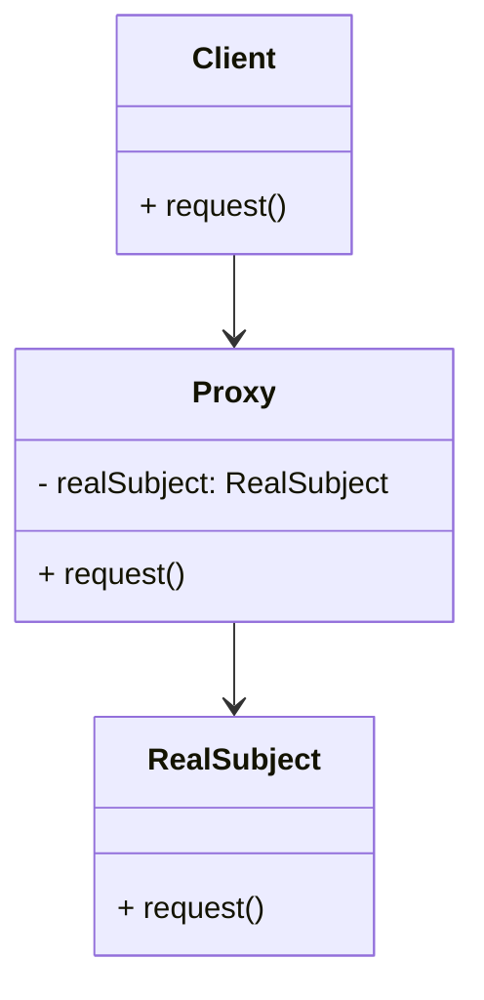

# Proxy Design Pattern

O padrão **Proxy** é um dos padrões de design estruturais. Ele é utilizado para fornecer um substituto ou intermediário
que controla o acesso a um objeto, permitindo executar algo antes ou depois de a solicitação ser repassada ao objeto
real.

Este padrão pode ajudar em vários cenários, como quando desejamos atrasar a inicialização de objetos pesados ou proteger
o acesso a alguns recursos.

---

## Estrutura

### Explicação

O Proxy atua como um intermediário para o objeto real. Ele pode conter lógica adicional, como controle de acesso, cache,
ou outro processamento antes de delegar a solicitação ao objeto final.

### Diagrama



1. **Client**: A classe que interage com o objeto abstrato (ou interface) sem se preocupar com a implementação concreta.
2. **RealSubject**: O objeto real que executará o trabalho principal.
3. **Proxy**: O intermediário que encapsula ou controla o acesso ao RealSubject.

---

## Implementação em Go

Segue um exemplo simples da aplicação do padrão Proxy no contexto de controle de acesso.

### Exemplo: Controle de acesso a um recurso

```go
package main

import "fmt"

// Subject é a interface comum para RealSubject e Proxy.
type Subject interface {
	Request()
}

// RealSubject é o objeto real que será acessado através do Proxy.
type RealSubject struct{}

func (r *RealSubject) Request() {
	fmt.Println("RealSubject: Processando a solicitação...")
}

// Proxy é o intermediário que controla o acesso ao RealSubject.
type Proxy struct {
	realSubject   *RealSubject
	authenticated bool
}

func NewProxy(authenticated bool) *Proxy {
	return &Proxy{
		realSubject:   &RealSubject{},
		authenticated: authenticated,
	}
}

func (p *Proxy) Request() {
	if p.authenticated {
		fmt.Println("Proxy: Autorização concedida. Encaminhando a solicitação para o RealSubject.")
		p.realSubject.Request()
	} else {
		fmt.Println("Proxy: Acesso negado. Usuário não autenticado.")
	}
}

func main() {
	fmt.Println("Tentando acessar sem autenticação:")
	unauthProxy := NewProxy(false)
	unauthProxy.Request()

	fmt.Println("\nTentando acessar com autenticação:")
	authProxy := NewProxy(true)
	authProxy.Request()
}
```

---

## Saída do Exemplo

```plaintext
Tentando acessar sem autenticação:
Proxy: Acesso negado. Usuário não autenticado.

Tentando acessar com autenticação:
Proxy: Autorização concedida. Encaminhando a solicitação para o RealSubject.
RealSubject: Processando a solicitação...
```

---

## Quando utilizar o Proxy?

- **Controle de acesso**: Limitar ou proteger o acesso a certas informações ou recursos.
- **Otimizando desempenho**: Adiar a criação ou inicialização de objetos custosos até que sejam realmente necessários (
  conhecido como Lazy Initialization).
- **Logging ou cache**: Interceptar chamadas para armazenar informações ou reutilizar resultados anteriores sem envolver
  o objeto real.

---

## Tipos de Proxy

- **Remote Proxy**: Controla o acesso a um objeto localizado em outra máquina (via rede).
- **Virtual Proxy**: Gerencia a criação e inicialização de objetos pesados sob demanda.
- **Protection Proxy**: Monitora e controla o acesso com base em permissões ou autenticação.
- **Cache Proxy**: Armazena em cache resultados já solicitados para evitar processamento e consultas desnecessárias.

---

## Benefícios

1. **Redução de carga**: Evita trabalhar diretamente com objetos custosos.
2. **Proteção**: Garante que apenas entidades autorizadas possam acessar o RealSubject.
3. **Flexibilidade**: Adiciona responsabilidade dinamicamente, sem modificar o objeto real.

---

## Conclusão

O padrão Proxy é extremamente útil em cenários que exigem controle sobre o acesso a um objeto ou gerenciamento adicional
antes de executar operações. Ele respeita o Princípio de Substituição de Liskov, já que o cliente pode interagir com o
Proxy ou com o objeto real de maneira transparente.
