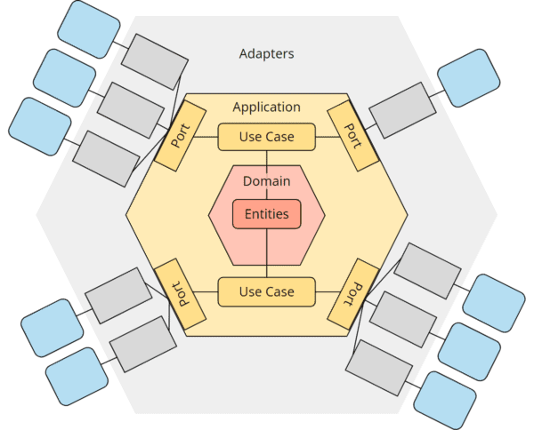

# Arquitetura Hexagonal

> A Arquitetura Hexagonal, também conhecida como Ports and Adapters, é um padrão de design de software proposto por
> Alistair Cockburn em 2005. Ela tem como objetivo principal promover a separação de preocupações, facilitando a
> manutenção, testes e a evolução do software. A ideia central é isolar a lógica de negócio (core) da aplicação das
> interfaces externas (UI, banco de dados, APIs externas, etc.), tornando o sistema mais modular e flexível.

--- 

### Princípios da Arquitetura Hexagonal

1. **Separação de Responsabilidades**:
    - A lógica de negócio deve ser independente de interfaces externas, como bancos de dados, APIs, interfaces gráficas,
      etc.
    - Isso permite que a aplicação seja testada e desenvolvida sem depender de sistemas externos.

2. **Portas e Adaptadores (Ports and Adapters)**:
    - **Portas**: São interfaces que definem como a aplicação interage com o mundo externo. Elas são abstrações que a
      lógica de negócio usa para se comunicar com o exterior.
    - **Adaptadores**: São implementações concretas das portas. Eles conectam a aplicação a sistemas externos, como
      bancos de dados, APIs, interfaces de usuário, etc.

3. **Independência de Tecnologia**:
    - A lógica de negócio não deve depender de tecnologias específicas (como frameworks, bibliotecas ou bancos de
      dados).
    - Isso permite que a aplicação seja facilmente adaptada a novas tecnologias sem alterar o núcleo do sistema.

4. **Testabilidade**:
    - A arquitetura hexagonal facilita a criação de testes unitários e de integração, pois a lógica de negócio pode ser
      testada isoladamente, sem depender de sistemas externos.

5. **Flexibilidade**:
    - A aplicação pode ser facilmente estendida ou modificada, pois as dependências externas são abstraídas através de
      portas e adaptadores.

--- 

### Componentes da Arquitetura Hexagonal

1. **Núcleo da Aplicação (Core)**:
    - Contém a lógica de negócio da aplicação.
    - É a parte mais importante do sistema e deve ser independente de qualquer tecnologia ou framework externo.

2. **Portas (Ports)**:
    - Interfaces que definem como o núcleo da aplicação interage com o mundo externo.
    - Existem dois tipos principais de portas:
        - **Portas de Entrada (Primary Ports)**: Permitem que o mundo externo interaja com a aplicação (por exemplo, uma
          API REST ou uma interface gráfica).
        - **Portas de Saída (Secondary Ports)**: Permitem que a aplicação interaja com sistemas externos (por exemplo,
          um banco de dados ou um serviço de mensageria).

3. **Adaptadores (Adapters)**:
    - Implementações concretas das portas.
    - Eles conectam a aplicação a sistemas externos.
    - Existem dois tipos principais de adaptadores:
        - **Adaptadores de Entrada (Primary Adapters)**: Implementam as portas de entrada e permitem que o mundo externo
          interaja com a aplicação (por exemplo, um controlador REST ou uma interface gráfica).
        - **Adaptadores de Saída (Secondary Adapters)**: Implementam as portas de saída e permitem que a aplicação
          interaja com sistemas externos (por exemplo, um repositório de banco de dados ou um cliente de mensageria).

---

### Benefícios da Arquitetura Hexagonal

1. **Facilidade de Testes**:
    - A lógica de negócio pode ser testada isoladamente, sem depender de sistemas externos.
    - Adaptadores podem ser facilmente substituídos por mocks ou stubs durante os testes.

2. **Manutenção Simplificada**:
    - Como a lógica de negócio está isolada, mudanças em interfaces externas (como a troca de um banco de dados) não
      afetam o núcleo da aplicação.

3. **Flexibilidade Tecnológica**:
    - A aplicação pode ser facilmente adaptada a novas tecnologias ou frameworks, pois a lógica de negócio não está
      acoplada a nenhuma tecnologia específica.

4. **Escalabilidade**:
    - A arquitetura hexagonal facilita a adição de novas funcionalidades ou a modificação de funcionalidades existentes,
      pois o núcleo da aplicação está bem isolado.

---

### Exemplo Prático

Vamos considerar um exemplo simples de uma aplicação de gerenciamento de usuários.

1. **Núcleo da Aplicação (Core)**:
    - Contém a lógica de negócio, como a criação de usuários, validação de dados, etc.

2. **Portas de Entrada (Primary Ports)**:
    - Uma interface `UserService` que define métodos como `createUser`, `getUser`, etc.

3. **Portas de Saída (Secondary Ports)**:
    - Uma interface `UserRepository` que define métodos como `save`, `findById`, etc.

4. **Adaptadores de Entrada (Primary Adapters)**:
    - Um controlador REST que implementa a interface `UserService` e expõe endpoints para criar e buscar usuários.

5. **Adaptadores de Saída (Secondary Adapters)**:
    - Uma implementação de `UserRepository` que se conecta a um banco de dados SQL para persistir e recuperar usuários.

---

### Fluxo de Dados

1. Um cliente faz uma requisição HTTP para criar um usuário.
2. O controlador REST (adaptador de entrada) recebe a requisição e chama o método `createUser` do `UserService` (núcleo
   da aplicação).
3. O `UserService` valida os dados e chama o método `save` do `UserRepository` (porta de saída).
4. O adaptador de saída (implementação do `UserRepository`) persiste os dados no banco de dados.
5. O controlador REST retorna uma resposta ao cliente.

---

### Estrutura de Pacotes



> Abaixo está um exemplo de como os pacotes podem ser organizados em uma aplicação de gerenciamento de usuários:

```
src/
├── main/
│   ├── java/
│   │   ├── com/
│   │   │   ├── exemplo/
│   │   │   │   ├── core/                  # Núcleo da aplicação (lógica de negócio)
│   │   │   │   │   ├── domain/            # Entidades e modelos de domínio
│   │   │   │   │   │   └── User.java
│   │   │   │   │   ├── service/           # Serviços de aplicação (casos de uso)
│   │   │   │   │   │   └── UserService.java
│   │   │   │   │   └── port/              # Portas (interfaces para comunicação com o exterior)
│   │   │   │   │       ├── in/            # Portas de entrada (interfaces para o mundo externo interagir com o core)
│   │   │   │   │       │   └── UserServicePort.java
│   │   │   │   │       └── out/           # Portas de saída (interfaces para o core interagir com o mundo externo)
│   │   │   │   │           └── UserRepositoryPort.java
│   │   │   │   ├── infrastructure/        # Adaptadores (implementações das portas)
│   │   │   │   │   ├── adapter/           # Adaptadores concretos
│   │   │   │   │   │   ├── in/            # Adaptadores de entrada (ex: controladores REST)
│   │   │   │   │   │   │   └── web/
│   │   │   │   │   │   │       └── UserController.java
│   │   │   │   │   │   └── out/           # Adaptadores de saída (ex: repositórios de banco de dados)
│   │   │   │   │   │       └── persistence/
│   │   │   │   │   │           └── UserRepositoryAdapter.java
│   │   │   │   │   └── config/            # Configurações (ex: beans, conexões com banco de dados)
│   │   │   │   │       └── DatabaseConfig.java
│   │   │   │   └── Application.java       # Classe principal da aplicação
│   ├── resources/                         # Recursos (ex: arquivos de configuração, templates)
│   │   └── application.properties
└── test/                                  # Testes
    └── java/
        └── com/
            └── exemplo/
                ├── core/                  # Testes do núcleo da aplicação
                │   └── service/
                │       └── UserServiceTest.java
                └── infrastructure/        # Testes dos adaptadores
                    └── adapter/
                        └── out/
                            └── persistence/
                                └── UserRepositoryAdapterTest.java
```

### Explicação dos Pacotes

1. **`core`**:
    - Contém a lógica de negócio da aplicação.
    - **`domain`**: Define as entidades e modelos de domínio (ex: `User`).
    - **`service`**: Implementa os casos de uso da aplicação (ex: `UserService`).
    - **`port`**: Define as interfaces (portas) que a aplicação usa para se comunicar com o mundo externo.
        - **`in`**: Portas de entrada (ex: `UserServicePort`), que permitem que o mundo externo interaja com o núcleo da
          aplicação.
        - **`out`**: Portas de saída (ex: `UserRepositoryPort`), que permitem que o núcleo da aplicação interaja com
          sistemas externos.

2. **`infrastructure`**:
    - Contém as implementações concretas das portas (adaptadores) e configurações da aplicação.
    - **`adapter`**: Implementa os adaptadores que conectam a aplicação a sistemas externos.
        - **`in`**: Adaptadores de entrada (ex: `UserController`), que implementam as portas de entrada e permitem que o
          mundo externo interaja com a aplicação (ex: via REST).
        - **`out`**: Adaptadores de saída (ex: `UserRepositoryAdapter`), que implementam as portas de saída e permitem
          que a aplicação interaja com sistemas externos (ex: banco de dados).
    - **`config`**: Contém configurações da aplicação, como beans do Spring, conexões com banco de dados, etc.

3. **`Application.java`**:
    - Classe principal da aplicação, responsável por inicializar o sistema.

4. **`resources`**:
    - Contém arquivos de configuração, como `application.properties`, que definem propriedades da aplicação (ex: URL do
      banco de dados).

5. **`test`**:
    - Contém os testes da aplicação, organizados de forma semelhante à estrutura principal.
    - **`core`**: Testes da lógica de negócio (ex: `UserServiceTest`).
    - **`infrastructure`**: Testes dos adaptadores (ex: `UserRepositoryAdapterTest`).

### Exemplo de Código

#### `core/domain/User.java`

```java
package com.exemplo.core.domain;

public class User {
    private Long id;
    private String name;
    private String email;

    // Getters e Setters
}
```

#### `core/service/UserService.java`

```java
package com.exemplo.core.service;

import com.exemplo.core.domain.User;
import com.exemplo.core.port.in.UserServicePort;
import com.exemplo.core.port.out.UserRepositoryPort;

public class UserService implements UserServicePort {
    private final UserRepositoryPort userRepository;

    public UserService(UserRepositoryPort userRepository) {
        this.userRepository = userRepository;
    }

    @Override
    public User createUser(User user) {
        // Lógica de negócio para criar um usuário
        return userRepository.save(user);
    }

    @Override
    public User getUserById(Long id) {
        return userRepository.findById(id);
    }
}
```

#### `core/port/in/UserServicePort.java`

```java
package com.exemplo.core.port.in;

import com.exemplo.core.domain.User;

public interface UserServicePort {
    User createUser(User user);
    User getUserById(Long id);
}
```

#### `core/port/out/UserRepositoryPort.java`

```java
package com.exemplo.core.port.out;

import com.exemplo.core.domain.User;

public interface UserRepositoryPort {
    User save(User user);
    User findById(Long id);
}
```

#### `infrastructure/adapter/out/persistence/UserRepositoryAdapter.java`

```java
package com.exemplo.infrastructure.adapter.out.persistence;

import com.exemplo.core.domain.User;
import com.exemplo.core.port.out.UserRepositoryPort;
import org.springframework.stereotype.Repository;

@Repository
public class UserRepositoryAdapter implements UserRepositoryPort {
    // Implementação concreta para persistir usuários no banco de dados
    @Override
    public User save(User user) {
        // Lógica para salvar no banco de dados
        return user;
    }

    @Override
    public User findById(Long id) {
        // Lógica para buscar no banco de dados
        return new User(); // Exemplo simplificado
    }
}
```

#### `infrastructure/adapter/in/web/UserController.java`

```java
package com.exemplo.infrastructure.adapter.in.web;

import com.exemplo.core.domain.User;
import com.exemplo.core.port.in.UserServicePort;
import org.springframework.web.bind.annotation.*;

@RestController
@RequestMapping("/users")
public class UserController {
    private final UserServicePort userService;

    public UserController(UserServicePort userService) {
        this.userService = userService;
    }

    @PostMapping
    public User createUser(@RequestBody User user) {
        return userService.createUser(user);
    }

    @GetMapping("/{id}")
    public User getUserById(@PathVariable Long id) {
        return userService.getUserById(id);
    }
}
```

### Conclusão

A Arquitetura Hexagonal é uma abordagem poderosa para o desenvolvimento de software, especialmente em sistemas complexos
que precisam ser flexíveis, testáveis e fáceis de manter. Ao isolar a lógica de negócio das interfaces externas, ela
promove a separação de preocupações e facilita a evolução do sistema ao longo do tempo.