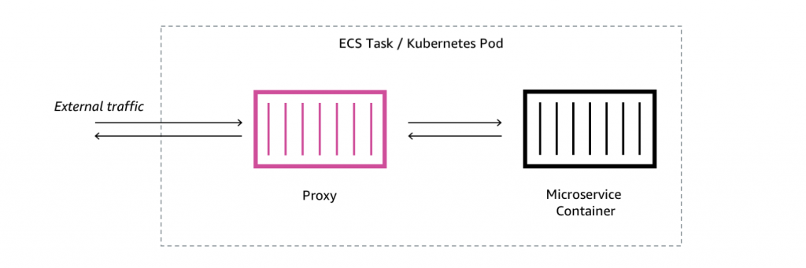

# Service Mesh

O **Service Mesh** é uma infraestrutura dedicada para gerenciar a comunicação entre microserviços em uma arquitetura
distribuída, geralmente em ambientes de nuvem ou Kubernetes. Ele é projetado para lidar com as complexidades de
comunicação entre serviços, como descoberta de serviços, balanceamento de carga, segurança, observabilidade e políticas
de tráfego, sem que o desenvolvedor precise se preocupar com a implementação desses aspectos em cada microserviço
individualmente.

### Componentes Principais do Service Mesh:

1. **Proxy Sidecar**:
   O core de um Service Mesh é o conceito de "proxy sidecar", que é um proxy leve que acompanha cada instância de
   microserviço, interceptando todo o tráfego de rede (entrante e saindo) para garantir que a comunicação seja
   controlada e segura.
    - **Envoy** é um dos proxies mais populares utilizados em Service Meshes como Istio, Linkerd e outros.
    - O proxy sidecar é responsável por executar funções como balanceamento de carga, segurança, roteamento, e coleta de
      métricas, sem impactar o código do microserviço.

2. **Control Plane (Plano de Controle)**:
   O plano de controle gerencia e configura os proxies sidecar distribuídos. Ele define como o tráfego entre os
   microserviços deve ser roteado, quais políticas de segurança devem ser aplicadas, e coleta métricas e logs de
   comunicação.
    - No caso do **Istio**, o plano de controle é composto por componentes como o **Pilot** (para controle de tráfego),
      **Mixer** (para políticas e telemetria), **Citadel** (para segurança), e **Galley** (para validação e
      configuração).
    - O **Linkerd**, que é uma solução mais leve, também possui seu próprio plano de controle.

### Funcionalidades do Service Mesh:

1. **Roteamento e Balanceamento de Carga**:
   O Service Mesh fornece funcionalidades avançadas de roteamento de tráfego entre microserviços, como:
    - **Roteamento de Tráfego**: Determinação de como e para onde o tráfego será enviado entre diferentes versões de um
      serviço (por exemplo, durante atualizações ou deploys canários).
    - **Balanceamento de Carga**: Distribuição de tráfego de maneira equilibrada entre instâncias de um microserviço
      para melhorar a performance e garantir alta disponibilidade.

2. **Segurança**:
    - **Criptografia de ponta a ponta (mTLS)**: O Service Mesh pode garantir que toda comunicação entre microserviços
      seja criptografada usando TLS (Transport Layer Security). Isso é feito sem que o desenvolvedor precise modificar
      os microserviços.
    - **Autenticação e Autorização**: Implementação de políticas de autenticação, como a verificação de identidade de
      serviços, e autorização, como a definição de quem pode acessar quais recursos dentro do sistema.

3. **Observabilidade**:
    - **Monitoramento e Telemetria**: O Service Mesh coleta dados sobre as comunicações entre serviços, como latência,
      taxa de erro, tempo de resposta e métricas de tráfego, e os envia para sistemas de monitoramento, como Prometheus
      e Grafana.
    - **Logs e Tracing**: Além de métricas, ele pode oferecer funcionalidades de logging e tracing distribuído,
      permitindo uma visão detalhada da jornada do tráfego entre serviços (ex: usando o Jaeger ou Zipkin para tracing).
    - **Debugging e Resolução de Problemas**: Como o tráfego entre microserviços é monitorado, é possível identificar e
      resolver problemas de rede e performance com mais eficiência.

4. **Política e Controle de Tráfego**:
    - **Política de Tráfego**: O Service Mesh permite a definição de regras de tráfego, como redirecionamento, retries,
      circuit breaking (interrupção de chamadas a serviços com falhas), etc.
    - **Limitação de Taxa (Rate Limiting)**: Controle sobre o número de requisições que podem ser feitas para um
      serviço, ajudando a proteger os recursos e evitar sobrecarga.

5. **Resiliência e Tolerância a Falhas**:
    - **Circuit Breaking**: Caso um serviço esteja com problemas, o Service Mesh pode interromper chamadas subsequentes
      para esse serviço, evitando que a falha se propague para outros serviços.
    - **Retries e Timeout**: O Service Mesh pode configurar tentativas automáticas (retries) em caso de falhas
      temporárias e aplicar limites de tempo (timeouts) nas requisições.

6. **A/B Testing e Deploy Canário**:
   O Service Mesh permite a realização de testes A/B ou deploys canários, onde diferentes versões de um serviço podem
   ser implementadas em uma fração do tráfego de produção, para observar como elas se comportam antes de um lançamento
   completo.

### Exemplos de Service Meshes Populares:

1. **Istio**:
   Istio é uma das soluções de Service Mesh mais populares, conhecida pela sua robustez e conjunto de funcionalidades.
   Ele oferece controle avançado sobre o tráfego de rede, segurança e observabilidade. O Istio é frequentemente usado em
   grandes ambientes de Kubernetes.

2. **Linkerd**:
   Linkerd é um Service Mesh leve e simples, focado na facilidade de uso e no desempenho. É uma alternativa ao Istio e é
   ideal para implementações menores ou para quem precisa de uma solução mais enxuta.

3. **Consul Connect**:
   O Consul, da HashiCorp, oferece funcionalidades de Service Mesh com foco em gerenciamento de serviços, descoberta e
   integração com ambientes híbridos, como em nuvens privadas e públicas.

### Vantagens do Service Mesh:

1. **Desacoplamento da Lógica de Comunicação**:
   O Service Mesh permite que as preocupações com comunicação entre microserviços sejam separadas do código do
   aplicativo. Isso melhora a manutenibilidade e reduz a complexidade do código.

2. **Facilidade de Implementação de Políticas**:
   Ele permite a implementação de políticas de segurança, tráfego e observabilidade de maneira centralizada e
   consistente em todos os microserviços.

3. **Escalabilidade e Flexibilidade**:
   A comunicação entre microserviços é gerenciada automaticamente, permitindo que a arquitetura escale sem que o
   desenvolvimento de cada serviço precise ser modificado para incluir essas funcionalidades.

4. **Redução de Overhead no Desenvolvimento**:
   A implementação de funcionalidades avançadas como mTLS, roteamento inteligente, e tracing distribuído é feita de
   maneira centralizada no Service Mesh, sem necessidade de alterações no código de cada microserviço.

### Desvantagens do Service Mesh:

1. **Complexidade Adicional**:
   Embora ofereça muitas funcionalidades, a implementação de um Service Mesh pode adicionar complexidade à
   infraestrutura e ao gerenciamento, especialmente em ambientes maiores.

2. **Desempenho**:
   A adição de proxies sidecar pode introduzir sobrecarga de desempenho, especialmente em sistemas com muitas instâncias
   de serviços. Essa sobrecarga precisa ser avaliada em ambientes de alta demanda.

3. **Curva de Aprendizado**:
   O uso de um Service Mesh pode exigir treinamento e compreensão dos conceitos subjacentes, o que pode ser um desafio
   para equipes que não têm experiência prévia com essas tecnologias.

### Conclusão:

O Service Mesh é uma solução poderosa para simplificar a gestão de microserviços em uma arquitetura distribuída,
oferecendo controle granular sobre comunicação, segurança e observabilidade. No entanto, seu uso deve ser ponderado,
levando em consideração os trade-offs em termos de complexidade e desempenho.

---

## **Links de Referência**

- [What is a service mesh?](https://aws.amazon.com/what-is/service-mesh/)

---
