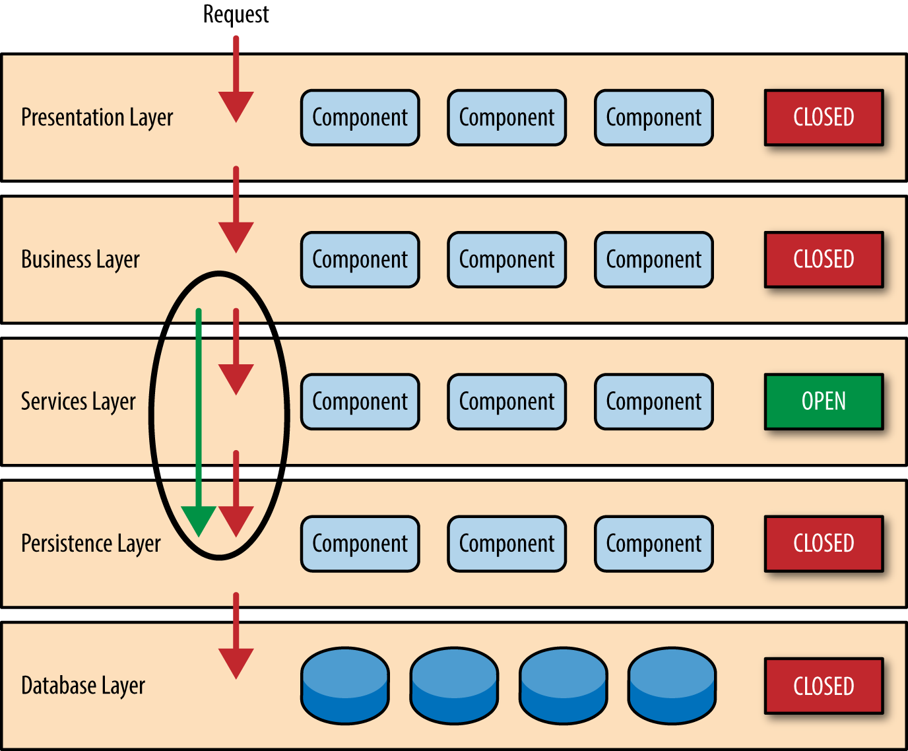

# Layered Architecture

A **Arquitetura de Camadas** (ou **Layered Architecture**) é um padrão de design utilizado em sistemas de software para
organizar o código de forma modular, separando as responsabilidades em diferentes camadas ou níveis. Essa abordagem
facilita a manutenção, a escalabilidade e a reutilização do código, além de proporcionar um claro desacoplamento entre
diferentes partes do sistema.

### Conceito Básico

A Arquitetura de Camadas divide o sistema em camadas distintas, onde cada camada tem uma responsabilidade específica e
só se comunica com a camada imediatamente abaixo ou acima dela. Isso ajuda a garantir a **separação de responsabilidades
** e promove **modularidade** no desenvolvimento de software.

#### Camadas Comuns em uma Arquitetura de Camadas:

1. **Camada de Apresentação (Presentation Layer)**:
    - **Responsabilidade**: A camada de apresentação é responsável pela interface com o usuário. Ela lida com a
      interação com o usuário, seja em um site, aplicativo móvel ou qualquer outra forma de front-end.
    - **Funções principais**: Exibir dados, capturar entrada do usuário e interagir com a camada de controle.
    - **Exemplo**: Em uma aplicação web, pode ser a camada que renderiza páginas HTML, manipula eventos de botões e
      fornece feedback visual ao usuário.

2. **Camada de Controle (Controller Layer)**:
    - **Responsabilidade**: A camada de controle recebe as solicitações da camada de apresentação, processa essas
      solicitações e interage com a camada de serviços ou de lógica de negócio para executar as operações necessárias.
    - **Funções principais**: Orquestrar o fluxo de dados entre a camada de apresentação e a camada de serviços,
      chamando as funcionalidades necessárias.
    - **Exemplo**: Em uma aplicação web MVC (Model-View-Controller), o controlador recebe requisições HTTP, invoca o
      modelo correspondente e retorna a resposta para o usuário.

3. **Camada de Lógica de Negócio (Business Logic Layer)**:
    - **Responsabilidade**: A camada de lógica de negócio implementa as regras e processos fundamentais do sistema. Ela
      é responsável por processar as informações de acordo com a necessidade do domínio da aplicação.
    - **Funções principais**: Validar dados, calcular e aplicar regras de negócio, e realizar operações mais complexas.
    - **Exemplo**: Em um sistema de e-commerce, esta camada pode ser responsável por calcular descontos, validar a
      disponibilidade de estoque e aplicar regras de pagamento.

4. **Camada de Dados (Data Layer)**:
    - **Responsabilidade**: A camada de dados gerencia a persistência e a recuperação dos dados. Ela lida com a
      interação com o banco de dados ou outros sistemas de armazenamento.
    - **Funções principais**: Consultar, inserir, atualizar e excluir dados no banco de dados. Também pode envolver o
      uso de cache e integração com sistemas externos.
    - **Exemplo**: Em um sistema de banco, esta camada pode ser responsável por acessar o banco de dados para verificar
      o saldo de uma conta ou realizar uma transferência.

5. **Camada de Infraestrutura (Infrastructure Layer)**:
    - **Responsabilidade**: A camada de infraestrutura fornece os recursos e serviços que suportam as outras camadas.
      Ela lida com funcionalidades como rede, autenticação, autorização, integração com sistemas de terceiros e outros
      serviços de suporte.
    - **Funções principais**: Implementar serviços de rede, segurança, gerenciamento de logs e tarefas de backend.
    - **Exemplo**: Gerenciamento de autenticação, cache distribuído, envio de emails, armazenamento em nuvem e outras
      operações de baixo nível.

### Exemplo de Fluxo de Dados

Aqui está um exemplo de como os dados fluem através de uma arquitetura de camadas:

1. **Usuário Interage com a Camada de Apresentação**:
    - O usuário acessa uma página de login (na camada de apresentação) e insere suas credenciais.

2. **Camada de Controle Processa a Solicitação**:
    - O controlador recebe as credenciais e chama a camada de serviços (lógica de negócios) para verificar a
      autenticidade do usuário.

3. **Camada de Lógica de Negócio Valida as Credenciais**:
    - A camada de lógica de negócios chama a camada de dados para verificar as credenciais no banco de dados.

4. **Camada de Dados Interage com o Banco de Dados**:
    - A camada de dados consulta o banco de dados para validar o nome de usuário e a senha.

5. **Retorno para o Usuário**:
    - Se as credenciais forem válidas, o controlador envia uma resposta para a camada de apresentação para redirecionar
      o usuário para a tela principal.
    - Caso contrário, o controlador retorna uma mensagem de erro para a camada de apresentação, que a exibe ao usuário.

### Benefícios da Arquitetura de Camadas

1. **Modularidade**:
    - Cada camada é responsável por uma função específica, facilitando a organização do código e a reutilização de
      componentes.

2. **Desacoplamento**:
    - As camadas são isoladas umas das outras. Isso significa que mudanças em uma camada não afetam diretamente as
      outras camadas, tornando o sistema mais flexível e fácil de manter.

3. **Facilidade de Testes**:
    - A separação das responsabilidades permite testar cada camada de forma independente. Isso facilita a execução de
      testes unitários e de integração.

4. **Escalabilidade**:
    - Com uma arquitetura modular, é mais fácil escalar o sistema, seja horizontalmente (adicionando mais instâncias de
      uma camada) ou verticalmente (melhorando a performance de uma camada específica).

5. **Manutenibilidade**:
    - A modularidade e a separação de responsabilidades tornam o código mais fácil de entender e de modificar, o que
      facilita a manutenção a longo prazo.

6. **Flexibilidade na Troca de Tecnologias**:
    - Em sistemas de camadas, é mais fácil substituir ou atualizar uma camada sem afetar as outras. Por exemplo, você
      pode trocar o banco de dados ou a tecnologia de persistência na camada de dados sem afetar a camada de
      apresentação ou lógica de negócios.

### Desvantagens da Arquitetura de Camadas

1. **Complexidade Inicial**:
    - A separação do sistema em camadas pode aumentar a complexidade no início do desenvolvimento, especialmente em
      sistemas simples.

2. **Desempenho**:
    - Em alguns cenários, a comunicação entre camadas pode introduzir latência. Por exemplo, chamar um serviço de
      negócios para acessar dados pode ser mais lento do que acessar diretamente o banco de dados, especialmente em
      sistemas de alto desempenho.

3. **Sobrecarga de Manutenção**:
    - Em sistemas grandes, o número de camadas pode se multiplicar, o que pode aumentar a complexidade na hora de
      gerenciar e manter o código.

### Exemplos de Implementações de Arquitetura de Camadas

- **MVC (Model-View-Controller)**: Uma das implementações mais conhecidas de arquitetura de camadas, com a divisão clara
  entre a camada de apresentação (View), o modelo de dados (Model) e a lógica de controle (Controller).
- **Aplicações Web**: Muitas arquiteturas de sistemas web utilizam uma divisão entre camada de apresentação (front-end),
  camada de controle (back-end) e camada de dados (banco de dados).
- **Aplicações de Microserviços**: Embora em microserviços a arquitetura de camadas possa ser mais fluida, a divisão de
  responsabilidades ainda pode ser aplicada entre a camada de API, serviços de domínio e armazenamento de dados.

### Conclusão

A **Arquitetura de Camadas** é uma abordagem eficaz para o desenvolvimento de sistemas de software organizados,
escaláveis e fáceis de manter. Ao separar as responsabilidades em diferentes camadas, ela oferece benefícios claros,
como modularidade, desacoplamento e facilidade de testes, mas também pode adicionar complexidade e sobrecarga dependendo
do contexto do projeto. Esse padrão é amplamente utilizado em sistemas corporativos, aplicações web e microserviços.
