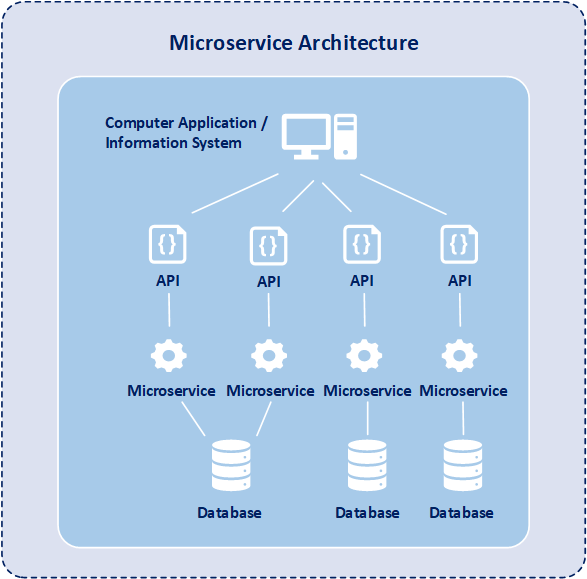

# Microservices

A arquitetura de **Microservices** é um padrão arquitetural que envolve a construção de sistemas como uma coleção de
pequenos serviços independentes, cada um responsável por uma única funcionalidade de negócio, e se comunicando entre si
através de interfaces bem definidas, geralmente APIs. Cada microserviço é autônomo, implementado e implantado de maneira
independente.

---

## 1. **Fundamentos de Microservices**

### O que são Microservices?

**Microservices** referem-se a uma abordagem arquitetural na qual um sistema é desenvolvido como uma série de pequenos
serviços independentes, autônomos e especializados em um único domínio de negócio. Esses serviços são criados,
implantados e escalados de forma independente, comunicando-se entre si geralmente por meio de APIs (REST, gRPC, etc.).

Cada **Microservice** possui suas próprias responsabilidades, base de dados e pode ser desenvolvido, testado e
implantado de forma independente. Isso permite uma maior flexibilidade no desenvolvimento e na escalabilidade.

### Características dos Microservices:

- **Descentralização**: Cada microserviço é responsável por seu próprio conjunto de dados e lógica de negócios,
  reduzindo a dependência de um banco de dados monolítico.
- **Escalabilidade independente**: Serviços podem ser escalados de forma independente conforme a demanda, otimizando o
  uso de recursos.
- **Resiliência**: Caso um serviço falhe, ele não afeta diretamente os outros, permitindo que o sistema como um todo
  seja mais resiliente.
- **Desenvolvimento independente**: Equipes diferentes podem trabalhar em microserviços distintos, com linguagens,
  ferramentas e ciclos de lançamento diferentes.
- **Foco em domínios de negócios**: Cada microserviço é projetado para resolver uma parte específica do problema de
  negócios, permitindo maior agilidade no desenvolvimento de novas funcionalidades.

---

## 2. **Arquitetura de Microservices**

A arquitetura de Microservices é baseada na decomposição de uma aplicação em diversos serviços pequenos e independentes.
Cada serviço pode ser implantado, escalado e mantido independentemente, e cada um tem a sua própria base de dados.

### **Componentes Principais de uma Arquitetura de Microservices**:

1. **API Gateway**:
    - Um ponto de entrada único para todas as requisições externas para o sistema.
    - Encaminha as requisições para os microserviços apropriados.
    - Pode ser utilizado para autenticação, monitoramento, roteamento de requisições e agregação de respostas.

2. **Serviços Independentes**:
    - Cada microserviço é uma unidade autônoma, com lógica de negócio e persistência de dados própria.
    - Pode ser desenvolvido usando diferentes tecnologias e frameworks, dependendo dos requisitos do serviço.

3. **Banco de Dados Independente**:
    - Cada microserviço deve possuir seu próprio banco de dados para garantir a independência de dados.
    - O banco de dados pode ser um banco SQL, NoSQL ou qualquer outro tipo adequado ao microserviço.

4. **Comunicação entre Microservices**:
    - **Síncrona**: Usando APIs REST, gRPC ou outros protocolos de comunicação.
    - **Assíncrona**: Usando filas de mensagens como Kafka, RabbitMQ ou outros sistemas de mensageria.
    - **Event-Driven Architecture**: Microserviços podem reagir a eventos gerados por outros microserviços.

5. **Ferramentas de Orquestração e Containerização**:
    - **Docker**: Para empacotar microserviços em containers, facilitando a implantação, escalabilidade e portabilidade.
    - **Kubernetes**: Para orquestrar containers e garantir alta disponibilidade e escalabilidade do sistema.

6. **Monitoramento e Log**:
    - Cada microserviço deve ser monitorado de forma independente.
    - Ferramentas como Prometheus, Grafana e ELK stack (Elasticsearch, Logstash, Kibana) podem ser usadas para
      centralizar logs e métricas.
    - O rastreamento de chamadas entre microserviços pode ser feito usando ferramentas como Jaeger ou Zipkin.

---

## 3. **Vantagens dos Microservices**

### 1. **Escalabilidade**

- Microserviços podem ser escalados individualmente conforme a demanda. Isso significa que, se um microserviço
  específico tem um alto volume de tráfego, ele pode ser escalado sem a necessidade de escalar todo o sistema.

### 2. **Desenvolvimento Independente**

- Equipes podem trabalhar de forma independente em diferentes microserviços, acelerando o tempo de desenvolvimento e
  permitindo ciclos de lançamento mais rápidos.

### 3. **Resiliência**

- Se um microserviço falhar, outros podem continuar a operar, o que melhora a resiliência e evita que uma falha em um
  componente afete todo o sistema.

### 4. **Flexibilidade Tecnológica**

- Diferentes microserviços podem ser desenvolvidos com tecnologias diferentes, o que significa que as equipes podem
  escolher a melhor ferramenta para cada caso.

### 5. **Facilidade de Manutenção**

- Microserviços são menores e mais focados, o que facilita a manutenção e evolução do sistema. Como cada microserviço
  tem um único objetivo, ele pode ser atualizado ou substituído sem afetar os outros.

### 6. **Escalabilidade da Equipe**

- Como as equipes podem trabalhar de forma independente em microserviços diferentes, a escalabilidade da equipe também
  se torna mais fácil. Equipes menores podem trabalhar em módulos ou funcionalidades específicas sem interferir no
  trabalho de outras.

---

## 4. **Desafios e Considerações**

Apesar das muitas vantagens, a adoção de uma arquitetura de microserviços também apresenta desafios, especialmente em
sistemas complexos.

### 1. **Complexidade Operacional**

- A multiplicidade de serviços pode aumentar significativamente a complexidade de gerenciamento e orquestração.

### 2. **Comunicação entre Microservices**

- A comunicação entre microserviços pode gerar latência, especialmente se for feita de forma síncrona, e pode ser
  difícil de gerenciar quando há falhas ou problemas de rede.

### 3. **Gerenciamento de Dados Distribuídos**

- Gerenciar dados em um ambiente de microserviços requer cuidados especiais, já que cada serviço tem seu próprio banco
  de dados.
- A consistência de dados pode ser mais difícil de garantir, especialmente em um sistema distribuído.

### 4. **Testabilidade**

- Testar uma arquitetura de microserviços pode ser mais complexo, pois é necessário testar a comunicação entre serviços
  e garantir que as mudanças em um microserviço não quebrem a funcionalidade de outros.

### 5. **Transações Distribuídas**

- Garantir a consistência e integridade dos dados em transações distribuídas pode ser desafiador. O uso de abordagens
  como o **SAGA pattern** (para gerenciar transações distribuídas) pode ser necessário.

---

## 5. **Padrões e Práticas Comuns**

### **API Gateway**

O **API Gateway** funciona como um ponto de entrada único para todos os microserviços, permitindo o roteamento de
requisições para os microserviços apropriados. Além disso, ele pode lidar com autenticação, balanceamento de carga e
outras funcionalidades transversais.

### **Service Discovery**

Em sistemas de microserviços, é comum que a localização dos microserviços mude dinamicamente. Ferramentas como **Consul
** ou **Eureka** ajudam os microserviços a se descobrirem uns aos outros de forma automática.

### **Circuit Breaker**

O padrão **Circuit Breaker** ajuda a isolar falhas em um microserviço e impede que falhas se propaguem para outros
serviços. Bibliotecas como **Hystrix** ou **Resilience4j** implementam esse padrão.

### **Mensageria e Event-Driven Architecture**

A comunicação entre microserviços pode ser feita de forma assíncrona usando filas de mensagens (como **RabbitMQ** ou *
*Kafka**), o que ajuda a desacoplar os serviços e melhorar a resiliência.

---

## 6. **Exemplo Prático de Microservices**

Imaginemos um sistema de **e-commerce** que tem microserviços para:

1. **Autenticação**: Responsável pela autenticação do usuário.
2. **Carrinho de Compras**: Gerencia os itens adicionados ao carrinho.
3. **Catálogo de Produtos**: Gerencia os produtos disponíveis para compra.
4. **Pedidos**: Processa a criação e o acompanhamento de pedidos.
5. **Pagamento**: Processa os pagamentos dos pedidos.

Cada um desses serviços tem uma base de dados independente, e a comunicação entre eles pode ocorrer via REST ou filas de
mensagens (eventos, como "PedidoCriado").

- **API Gateway**: O ponto de entrada único que direciona as requisições para os microserviços.
- **Service Discovery**: Utiliza Consul para encontrar serviços de maneira dinâmica.
- **Monitoramento**: Usa Prometheus e Grafana para monitorar a saúde dos microserviços.

---

## 7. **Conclusão**

A arquitetura de **Microservices** permite a construção de sistemas flexíveis, escaláveis e resilientes, aproveitando o
desenvolvimento independente de serviços autônomos. No entanto, ela traz complexidade em termos de gestão, comunicação
entre serviços e consistência de dados, e deve ser adotada com planejamento cuidadoso para garantir que os benefícios
superem os desafios.

